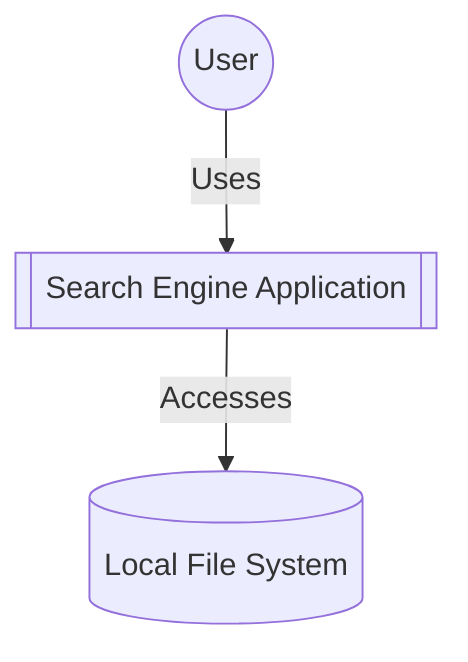
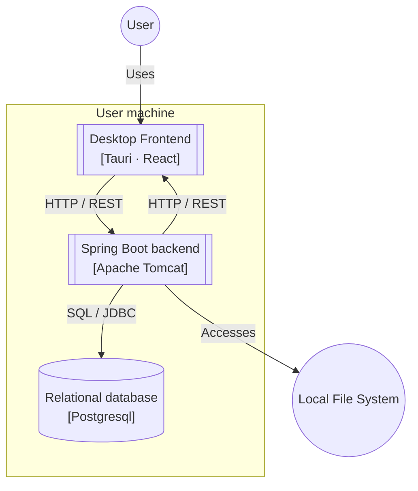
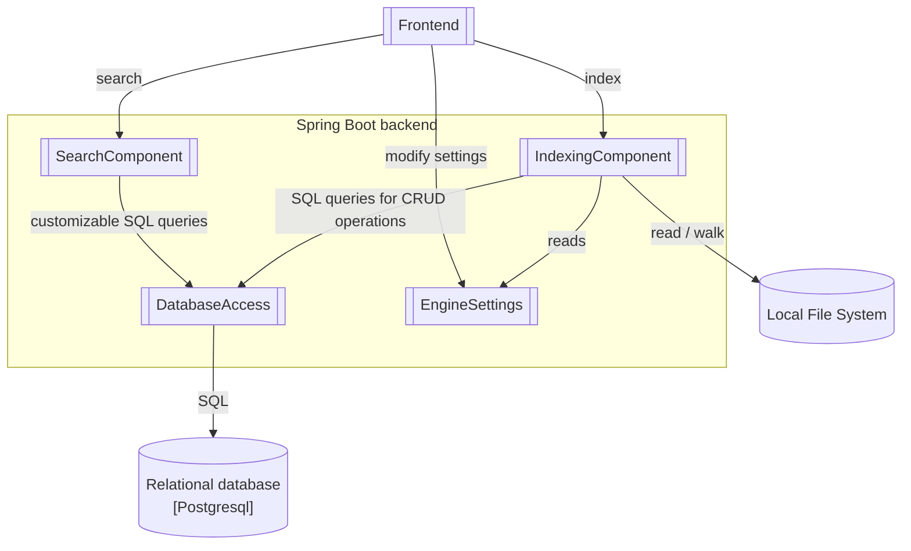
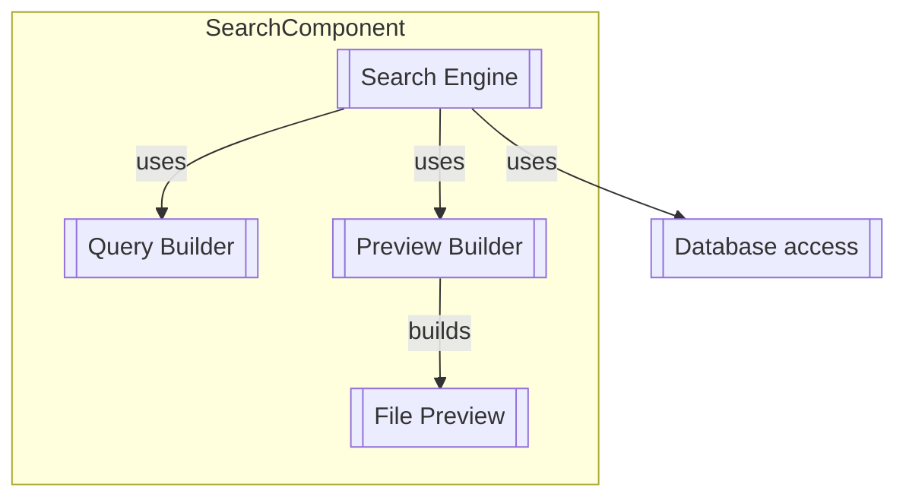
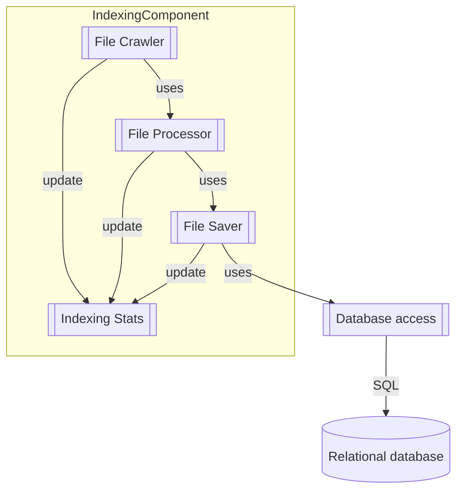
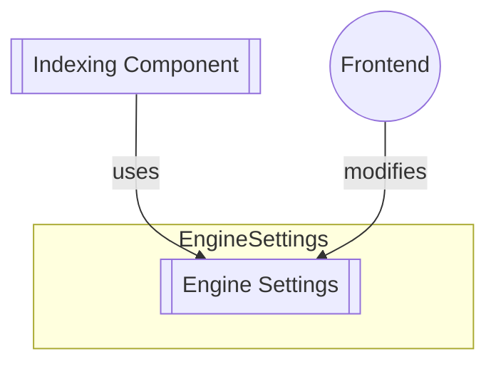
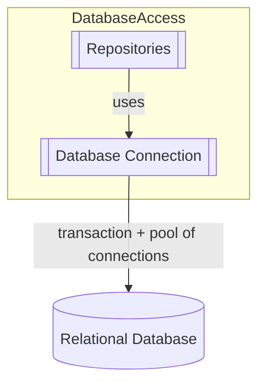
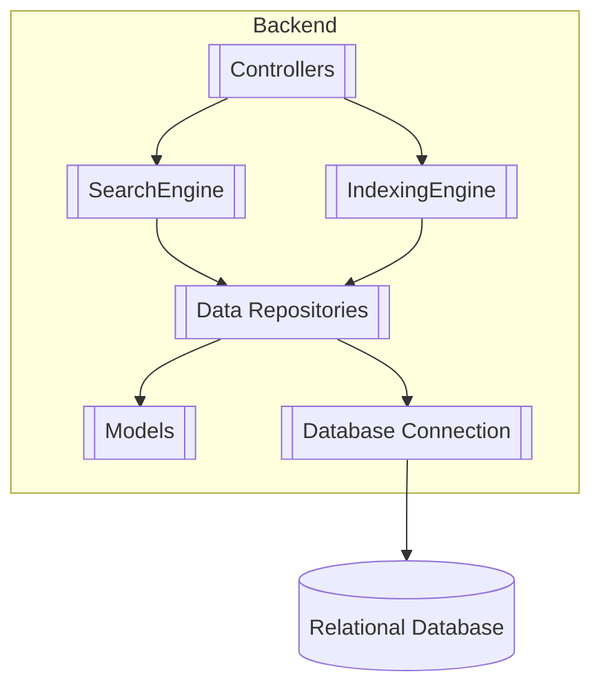

# Local File System Search Engine - Architecture Overview

This document describes the overall architectural considerations of the search engine, following the guidelines of the C4 model. Thus, the system is analyzed from 4 perspectives/levels: system context, containers, components, classes.  

## 1. System Context (LEVEL 1)

### Primary Actor
The **User** is the primary actor who directly interacts with the Search Engine Application to perform searches and retrieve information.

### System Responsibility

- Recursively traverse directories to discover files.
- Extract and validate file data before storing it.
- Insert and update file metadata in a relational database.
- Perform incremental indexing by detecting and updating only modified files.
- Support efficient multi-word search using full-text search features of the DBMS.
- Provide relevant search results with basic file previews.
- Maintain a well-designed database schema with appropriate data types and indexes.
- Handle runtime configuration (e.g., root directory, file ignore rules, report format).
- Track indexing progress and generate summary reports.
- Gracefully handle edge cases:
    - File permission errors
    - Symbolic link loops
    - Corrupted or unsupported files
    - Database connection timeouts
- Provide robust error handling.

### External Dependencies
1. The system depends on the **Operating System** for file management operations.  
2. The Operating System provides access to the **Local File System**, which stores the documents and data that the application indexes and searches.

## 2. Containers (LEVEL 2)
The system's containers correspond to independently deployable units into which the system can be divided.

| Container           |                                                                                      Responsibility                                                                                       |
|:--------------------|:-----------------------------------------------------------------------------------------------------------------------------------------------------------------------------------------:|
| Desktop Frontend    | Allows the user to index directories, search files using several search criteria and modify general settings of the search engine without taking care of the inner workings of the system |
| Backend             |                                                       All core logic, including file crawling, indexing, search and database access                                                       |
| Postgresql Database |                                                 Persistent storage of file information. Internal indexing schema used for fast searches.                                                  |
  
## 3. Components (LEVEL 3)

This level breaks the Core logic (Backend) into more specific components.  

| Component         |                                                                               Responsibility                                                                               |
|:------------------|:--------------------------------------------------------------------------------------------------------------------------------------------------------------------------:|
| SearchComponent   |                        Builds SQL queries from user search parameters and uses postgresql full text search capabilities to retrieve file previews.                         |
| IndexingComponent |  Walks recursively through the file system and indexes into the database the files that are not already present or have benn modified/created since last index operation.  |
| EngineSettings    | General setting used by the search engine, which can be set by the user: paths to be ignored, files to be ignored, root directories for search and reporting capabilities. |
| DatabaseAccess    |                                              Creates Postgresql pool of connections and makes CRUD operation on the database.                                              |

## 4. Classes (LEVEL 4)
In these diagrams each component is further broken down into classes.
### 4.1. SEARCH COMPONENT 

### 4.2. INDEXING CCOMPONENT

### 4.3. ENGINE SETTING

### 4.4. DATABASE ACCESS

# Backend architecture overview
The backend of this project is implemented using Java Spring Boot and employs a layered architecture.
